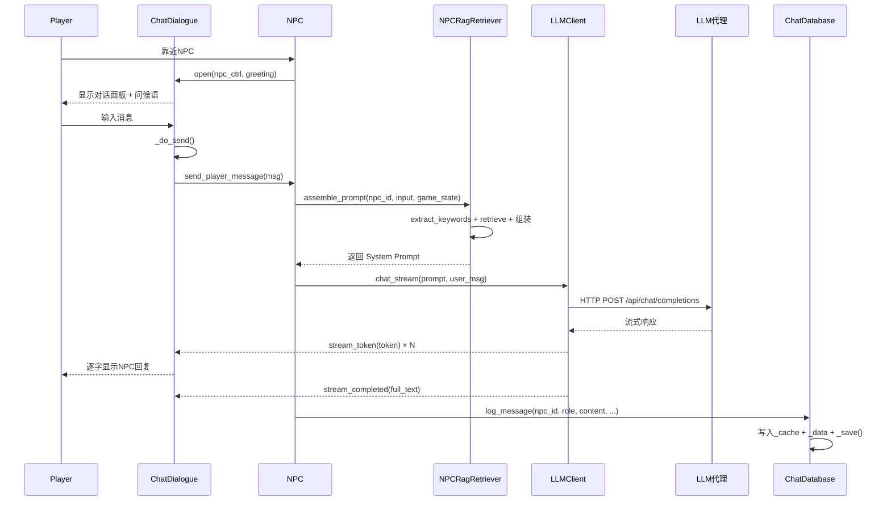
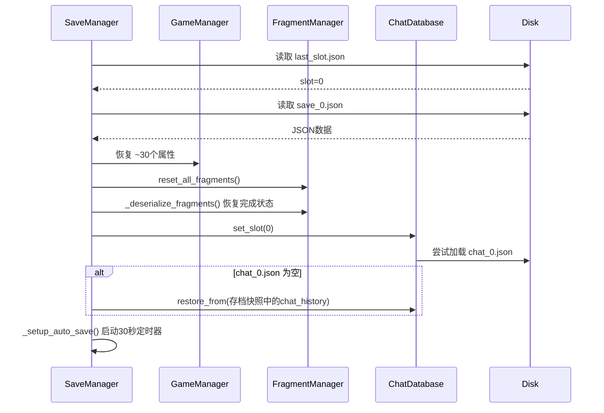

# 溯光计划 Autoload 系统架构文档

> 生成日期：2025-07-14 | 分析范围：12 个 Autoload 单例 | Godot 4.x

---

## 一、各 Autoload 职责摘要

### 1.1 核心层（Globals）

#### GameManager — 游戏全局状态管理器
**职责**：管理游戏核心状态（阶段、修复进度、暗线、六色觉醒、NPC状态缓存），是整个游戏状态的单一事实来源。

| 核心信号 | 核心方法 |
|----------|----------|
| `phase_changed(new_phase)` | `new_game()` — 重置全部状态 |
| `progress_updated(progress)` | `reset_fragment()` — 重置关卡内进度 |
| `fragment_repaired(fragment_id)` | `set_phase(new_phase)` — 切换阶段 |
| `decryption_complete(fragment_id)` | `add_repair_progress(amount)` — 增加修复进度 |
| `clue_collected(clue)` | `record_source_mark(...)` — 记录源印 |
| `color_awakened(color_type, npc_id)` | `awaken_color(color_type)` — 颜色觉醒 |
| — | `save_npc_state / load_npc_state / clear_npc_state` — NPC状态缓存 |

---

#### FragmentManager — 碎片管理器
**职责**：管理全部 12 个碎片的元数据、进入/完成状态、星图归位标记。

| 核心信号 | 核心方法 |
|----------|----------|
| `fragment_entered(fragment_id)` | `get_fragment_by_id(id)` — 按ID查找 |
| `fragment_completed(fragment_id)` | `get_available_fragments()` — 获取已实现碎片 |
| — | `enter_fragment(fragment)` — 进入碎片（调用 `GameManager.reset_fragment()`） |
| — | `complete_fragment(fragment)` — 标记完成 |
| — | `reset_all_fragments()` — 重置所有完成状态 |

**内部类 `FragmentData`**：id, name, world_name, hint, source_mark_name, difficulty, is_story_critical, scene_path, implemented, completed

---

#### SaveManager — 存档管理器
**职责**：管理多槽位（0-2）存档/读档、自动存档（30秒间隔）、数据序列化与恢复。**是持久化的唯一入口**。

| 核心方法 |
|----------|
| `save_game(slot)` — 序列化全量状态到 JSON |
| `load_game(slot)` — 从 JSON 恢复全部状态 |
| `set_current_slot(slot)` — 切换活跃槽位 |
| `list_slots()` — 扫描全部槽位信息 |
| `delete_slot(slot)` — 删除存档 |
| `manual_save()` — 手动存档（F5触发） |

**存档数据覆盖范围**：GameManager（~30个属性） + FragmentManager（碎片完成状态） + ChatDatabase（聊天历史）

---

#### ChatDatabase — 聊天记录混合存储
**职责**：按存档槽位隔离存储 NPC 对话记录。内存缓存（最近20条，供 LLM 使用）+ 磁盘全量持久化（`chat_{slot}.json`）。

| 核心方法 |
|----------|
| `log_message(npc_id, role, content, alert_phase, suspicion)` — 记录消息 |
| `get_history_as_text(npc_id, max_messages)` — 获取 LLM 上下文文本 |
| `get_page(npc_id, page, page_size)` — 分页查询历史 |
| `set_slot(slot)` / `flush_to_disk()` / `restore_from(raw)` — 槽位/持久化 |
| `clear_all_history()` / `clear_npc_history(npc_id)` — 清理 |

---

#### SceneManager — 场景切换管理器
**职责**：封装跨场景切换逻辑，管理出生点传递，委托 SceneFader 执行过渡动画。

| 核心信号 | 核心方法 |
|----------|----------|
| `scene_changing(target, spawn)` | `change_scene(path, spawn_point)` → 委托 `SceneFader.fade_out_and_switch()` |
| `scene_changed(target)` | `_raw_switch(path)` — 实际执行 `change_scene_to_file`（被 SceneFader 回调） |

**关键属性**：`pending_spawn_point: String` — 跨场景传递的出生点名称

---

#### SceneFader — 场景过渡动画
**职责**：提供黑屏淡入/淡出动画，在淡出完成后回调 SceneManager 执行实际场景切换。

| 核心方法 |
|----------|
| `ensure_black()` — 强制全黑（防止新场景闪现） |
| `fade_out_and_switch(scene)` — 淡出 → 调用 `SceneManager._raw_switch()` |
| `fade_in()` — 淡入（新场景 ready 后调用） |

**与 SceneManager 的关系**：双向调用 — SceneManager 调用 SceneFader 启动过渡，SceneFader 回调 SceneManager 执行实际切换。

---

### 1.2 系统层（Systems）

#### LLMClient — LLM API 客户端
**职责**：通过同源 Node 代理向 LLM API 发送请求，管理 HTTP 连接状态机，支持流式响应。

| 核心信号 | 核心方法 |
|----------|----------|
| `stream_token(token)` | `chat_stream(system_prompt, user_message, callback)` — 发起对话请求 |
| `stream_completed(full_text)` | `is_busy()` — 检查是否有进行中的请求 |
| `stream_failed(error)` | `is_api_key_configured()` — 检查代理地址 |

**状态机**：IDLE → CONNECTING → REQUESTING → RECEIVING → DONE

---

#### NPCRagRetriever — NPC 知识库 RAG 检索器
**职责**：从 7 个 NPC 知识库 JSON 文件中按需检索知识块，组装精简 System Prompt，减少 LLM token 消耗。

| 核心方法 |
|----------|
| `assemble_prompt(npc_id, player_input, game_state)` — **主入口**：组装完整 System Prompt |
| `retrieve(npc_id, player_input, game_state)` — 检索 Top-5 相关 chunks |
| `extract_keywords(player_input)` — 关键词提取（含风险词/情绪词/NPC名检测） |
| `get_fallback_response(npc_id)` — 检索失败时的降级模板回复 |

**知识层级**：L0(核心身份) → L0.5(世界观规则+反编撰) → L1(输出约束) → L2(检索知识块) → L3(游戏状态上下文)

---

#### InventoryManager — 背包/物品管理系统
**职责**：管理玩家收集的物品列表，提供背包数据查询接口。

| 核心信号 | 核心方法 |
|----------|----------|
| `item_added(item_id)` | `add_item(item_id)` / `remove_item(item_id)` / `has_item(item_id)` |
| `item_removed(item_id)` | `get_all_items()` / `get_item_count()` / `get_item_meta(item_id)` |
| `backpack_toggled(is_open)` | — |

**已定义物品**（ItemID 枚举）：FORGE_LOG(铸造日志)、CORNFLOWER(矢车菊)、FIRE_SEED(火种)

---

### 1.3 UI 层（UI）

#### ChatDialogue — QQ风格聊天对话UI
**职责**：管理 NPC 对话面板的完整生命周期——打开/关闭、消息气泡渲染、流式输出、历史翻阅、警觉弹窗。

| 核心信号 | 核心方法 |
|----------|----------|
| `dialogue_opened(npc_name)` | `open(npc_ctrl, greeting)` — 打开对话面板 |
| `dialogue_closed()` | `close()` — 关闭面板 |
| `player_message_sent(message)` | `stream_begin/stream_add/stream_end(...)` — 流式输出控制 |
| — | `add_npc_msg / add_player_msg` — 消息追加 |
| — | `show_alert_popup(...)` — 警觉变化弹窗 |
| — | `show_alert_phase_change(...)` — 警觉阶段变化弹窗 |
| — | `shake_screen(intensity)` — 震屏效果 |

**CanvasLayer 层级**：128（最高层）

---

#### BackpackUI — 背包界面
**职责**：管理背包 UI 的打开/关闭、物品网格渲染、自动刷新。

| 核心方法 |
|----------|
| `open()` / `close()` / `toggle()` |
| `_refresh_grid()` — 刷新物品网格（6格，含空位） |

**交互约束**：ChatDialogue 打开时阻止背包打开（`_input` 中检查 `ChatDialogue.is_open`）

**CanvasLayer 层级**：127

---

#### PauseMenu — ESC暂停菜单
**职责**：管理暂停菜单的打开/关闭，提供"返回星图/保存/返回标题"三项操作。菜单打开时暂停游戏（`get_tree().paused = true`）。

| 核心信号 | 核心方法 |
|----------|----------|
| `menu_opened` | `open()` / `close()` / `toggle()` |
| `menu_closed` | `_do_save(slot)` — 执行存档（含覆盖确认） |
| — | `_return_to_star_map()` — 返回星图场景 |
| — | `_return_to_title()` — 返回标题画面 |

**特殊处理**：`process_mode = PROCESS_MODE_ALWAYS`（暂停时自身继续运行）  
**CanvasLayer 层级**：100

---

## 二、交互关系图

```mermaid
graph TD
    subgraph 核心层
        GM[GameManager<br/>游戏状态]
        FM[FragmentManager<br/>碎片管理]
        SM[SaveManager<br/>存档管理]
        CD[(ChatDatabase<br/>聊天存储)]
        SCM[SceneManager<br/>场景切换]
        SF[SceneFader<br/>过渡动画]
    end

    subgraph 系统层
        LLM[LLMClient<br/>AI客户端]
        RAG[NPCRagRetriever<br/>知识检索]
        INV[InventoryManager<br/>物品管理]
    end

    subgraph UI层
        DIALOG[ChatDialogue<br/>对话UI]
        BP[BackpackUI<br/>背包UI]
        PM[PauseMenu<br/>暂停菜单]
    end

    subgraph 外部系统
        NPC[NPC场景节点]
        PROXY[LLM代理服务]
        KB[知识库JSON文件]
        DISK[存档文件]
    end

    %% === 直接调用（实线） ===
    FM -->|enter_fragment调用reset_fragment| GM
    GM -->|new_game调用reset_all_fragments| FM
    SCM -->|change_scene调用fade_out_and_switch| SF
    SF -->|淡出完成后调用_raw_switch| SCM
    SM -->|save_game读取~30个属性| GM
    SM -->|save_game序列化碎片状态| FM
    SM -->|save_game前flush_to_disk| CD
    SM -->|load_game恢复全部属性| GM
    SM -->|load_game恢复碎片完成状态| FM
    SM -->|load_game恢复聊天数据| CD
    DIALOG -->|历史翻页get_page| CD
    BP -->|读写物品数据| INV
    PM -->|存档操作| SM
    PM -->|读取| SCM
    PM -->|监听fragment_entered| FM
    RAG -->|加载知识库| KB
    LLM -->|HTTP请求| PROXY

    %% === 信号连接（虚线） ===
    BP -.->|item_added/item_removed信号| INV
    PM -.->|fragment_entered信号| FM

    %% === 数据读写（点线） ===
    SM -.->|JSON读写| DISK
    CD -.->|chat_{slot}.json读写| DISK
    GM -.->|save_{slot}.json内嵌| DISK
```

**图例说明**：
- **实线箭头（→）**：直接方法调用
- **虚线箭头（-·→）**：信号连接
- **点线箭头（-.-→）**：数据文件读写

**关键关系速查**：

| 调用方 | 被调用方 | 关系类型 | 说明 |
|--------|----------|----------|------|
| FragmentManager | GameManager | 直接调用 | `enter_fragment()` → `GameManager.reset_fragment()` |
| GameManager | FragmentManager | 直接调用 | `new_game()` → `FragmentManager.reset_all_fragments()` |
| SceneManager | SceneFader | 直接调用 | `change_scene()` → `SceneFader.fade_out_and_switch()` |
| SceneFader | SceneManager | 回调调用 | `fade_out_and_switch()` → `SceneManager._raw_switch()` |
| SaveManager | GameManager | 读写~30属性 | 存档时序列化，读档时恢复 |
| SaveManager | FragmentManager | 读写碎片状态 | `_serialize_fragments()` / `_deserialize_fragments()` |
| SaveManager | ChatDatabase | 调用接口 | `flush_to_disk()` / `restore_from()` / `set_slot()` |
| ChatDialogue | ChatDatabase | 直接调用 | `get_page()` 查历史 |
| BackpackUI | InventoryManager | 直接调用+信号 | 读写物品 + 监听变化 |
| PauseMenu | SaveManager | 直接调用 | `set_current_slot()` / `save_game()` / `list_slots()` |
| PauseMenu | FragmentManager | 信号监听 | `fragment_entered` → 控制"返回星图"菜单项 |
| PauseMenu | SceneManager | 属性读写 | 读取/清空 `pending_spawn_point` |

---

## 三、关键数据流

### 3.1 NPC 对话流程（端到端）

```
1. 玩家靠近NPC → NPC场景节点调用 ChatDialogue.open(npc_ctrl, greeting)
2. ChatDialogue 打开对话面板，显示问候语
3. 玩家输入消息 → ChatDialogue._do_send() → player_message_sent 信号
4. NPC节点接收消息 → 调用 NPCRagRetriever.assemble_prompt(npc_id, input, game_state)
   └─ NPCRagRetriever 内部：
       ├─ extract_keywords(input) → 提取关键词/风险词/情绪词/NPC名
       ├─ retrieve(npc_id, input, game_state) → 检索 Top-5 知识块
       └─ 组装完整 System Prompt（L0+L0.5+L1+L2+L3+对话历史）
5. NPC节点调用 LLMClient.chat_stream(prompt, user_msg, callback)
6. LLMClient → 同源代理 → LLM API
7. 流式响应：stream_token → ChatDialogue.stream_add()
8. 完成响应：stream_completed → ChatDialogue.stream_end()
9. NPC节点调用 ChatDatabase.log_message() 持久化本轮对话
10. 玩家关闭或ESC → ChatDialogue.close()
```



---

### 3.2 碎片收集流程

```
1. 玩家从星图选择碎片 → FragmentManager.enter_fragment(fragment)
   └─ FragmentManager 内部调用 GameManager.reset_fragment() 清除关卡内临时状态
2. 场景加载 → PlayerController 使用 SceneManager.pending_spawn_point 定位出生点
3. 玩家在碎片世界中探索、对话、收集线索
4. 条件满足 → FragmentManager.complete_fragment(fragment)
   └─ 设置 fragment.completed = true
   └─ fragment_completed 信号发出
5. NPC节点或场景脚本调用 GameManager.record_source_mark(fragment_id, mark_name, clue)
   └─ 增加 repaired_fragments 计数
   └─ 增加 repair_progress
   └─ fragment_repaired 信号发出
6. 玩家返回星图（通过 PauseMenu._return_to_star_map() 或场景内的出口）
```

---

### 3.3 存档加载流程

```
1. 游戏启动 → SaveManager._ready()
   └─ 读取 last_slot.json → 获取上次活跃槽位
   └─ load_game(last_slot) → 恢复全量状态
2. load_game(slot) 内部：
   ├─ 读取 save_{slot}.json
   ├─ 恢复 GameManager 全部属性（~30个）
   ├─ 调用 FragmentManager.reset_all_fragments() → 再按存档恢复 completed
   ├─ 调用 ChatDatabase.set_slot(slot) → 切换槽位
   │   └─ 如果 chat_{slot}.json 为空，从存档快照 restore_from()
   │   └─ 否则直接加载 chat_{slot}.json
   └─ 设置 _current_slot = slot
3. 启动自动存档定时器（30秒间隔）
```



---

### 3.4 场景切换流程

```
1. 调用方调用 SceneManager.change_scene(target_path, spawn_point_name)
2. SceneManager 设置 pending_spawn_point，发出 scene_changing 信号
3. SceneManager 调用 SceneFader.fade_out_and_switch(target_path)
4. SceneFader 创建 Tween → 0.25秒淡出至全黑
5. 淡出完成 → SceneFader 调用 SceneManager._raw_switch(target_path)
6. SceneManager 调用 get_tree().change_scene_to_file(target_path)
7. 新场景加载 → PlayerController._ready() 读取 SceneManager.pending_spawn_point
8. 新场景调用 SceneFader.fade_in() → 0.35秒淡入
```

---

### 3.5 六色觉醒流程

```
1. 玩家在碎片 #0762（灰白小镇）中与特定NPC互动达到条件
2. NPC节点调用 GameManager.awaken_color(color_type)
   └─ GameManager 检查是否已觉醒 → 设置 awakened_colors[type] = true
   └─ 发出 color_awakened 信号
3. 下游响应：
   ├─ 其他NPC节点监听该信号 → 更新对话内容
   ├─ NPCRagRetriever.assemble_prompt() 读取 awakened_colors → 注入L3状态上下文
   └─ SaveManager.save_game() 将 awakened_colors 持久化
4. 集齐5色 → white_ready = true → 老画家可解锁白色
5. 集齐6色 → 触发终局条件
```

---

## 四、分层架构

```
┌────────────────────────────────────────────────────────┐
│                      UI 层 (3)                          │
│  ChatDialogue       BackpackUI        PauseMenu        │
│  (CanvasLayer 128)  (CanvasLayer 127) (CanvasLayer 100)│
│                                                        │
│  ▸ 依赖规则：只读下层数据，不修改核心状态                │
│  ▸ 例外：PauseMenu 通过 SaveManager 间接写入（存档操作） │
└────────────┬──────────────────────┬────────────────────┘
             │                      │
┌────────────▼──────────────────────▼────────────────────┐
│                    系统层 (3)                           │
│  LLMClient        NPCRagRetriever    InventoryManager  │
│                                                        │
│  ▸ 依赖规则：只依赖核心层和外部资源，不依赖UI层          │
│  ▸ LLMClient：纯网络层，与游戏逻辑解耦                   │
│  ▸ NPCRagRetriever：只读知识库+GameManager状态          │
└────────────┬───────────────────────────────────────────┘
             │
┌────────────▼───────────────────────────────────────────┐
│                    核心层 (6)                           │
│                                                        │
│  GameManager  ←──→  FragmentManager                    │
│       ↑                    ↑                           │
│       │                    │                           │
│  SaveManager ──→ ChatDatabase                          │
│       │                                                │
│  SceneManager ←──→ SceneFader                          │
│                                                        │
│  ▸ 依赖规则：核心层内部允许互相调用（但应避免循环）       │
│  ▸ SaveManager 是持久化中枢，读写所有核心层数据          │
└────────────────────────────────────────────────────────┘
```

### 层间依赖规则

| 规则 | 说明 |
|------|------|
| **UI → 系统层/核心层** | ✅ 允许。UI 读取系统和核心数据用于展示 |
| **UI → 核心层写入** | ⚠️ 仅限通过 SaveManager。PauseMenu 的存档操作通过 SM 代理 |
| **系统层 → 核心层** | ✅ 允许。NPCRagRetriever 读取 GameManager 状态 |
| **核心层 → UI层** | ❌ 禁止。核心层不应感知UI存在 |
| **核心层 → 系统层** | ❌ 禁止。核心层不应依赖系统层（目前无违规） |
| **UI 内部** | 可互相检查状态（如 BackpackUI 检查 ChatDialogue.is_open） |

---

## 五、潜在问题与建议

### 5.1 循环依赖风险

#### ⚠️ 问题 1：SceneManager ↔ SceneFader 双向依赖（高风险）

```
SceneManager.change_scene() → SceneFader.fade_out_and_switch()
SceneFader.fade_out_and_switch() → SceneManager._raw_switch()
```

**分析**：两者形成紧耦合的双向调用。SceneFader 直接调用 SceneManager 的 `_raw_switch()` 方法（以下划线命名暗示"私有"，但 GDScript 无 true private），这意味着 SceneFader 无法脱离 SceneManager 独立工作。

**建议**：使用信号解耦。SceneFader 在淡出完成后发出 `fade_out_finished` 信号，由 SceneManager 监听并执行切换：

```gdscript
# SceneFader
signal fade_out_finished(target_scene: String)

func fade_out_and_switch(scene: String) -> void:
    # ... tween to black ...
    fade_out_finished.emit(scene)  # 替代直接调用 SceneManager._raw_switch()

# SceneManager._ready()
SceneFader.fade_out_finished.connect(_raw_switch)
```

---

#### ⚠️ 问题 2：GameManager ↔ FragmentManager 双向依赖（中风险）

```
FragmentManager.enter_fragment() → GameManager.reset_fragment()
GameManager.new_game() → FragmentManager.reset_all_fragments()
```

**分析**：两者互相调用。从语义上看合理——进入碎片需要重置关卡状态，开始新游戏需要重置所有碎片。但这种耦合使单元测试困难，且修改任一方都需考虑对方状态。

**建议**：将 `reset_fragment()` 的调用从 FragmentManager 中移出，改为由场景加载逻辑在 `enter_fragment` 之后显式调用，或通过信号通知。或者接受这种耦合（因为它们在概念上确实是紧密相关的"游戏状态"和"关卡管理"），但需在注释中明确标注双向依赖关系。

---

### 5.2 耦合度问题

#### ⚠️ 问题 3：SaveManager 对 GameManager 的强耦合（高风险）

SaveManager 直接读写 GameManager 的 **~30 个属性**，包括：
- 基础状态：`play_time_seconds`, `repair_progress`, `repaired_fragments`, `current_phase`, `player_name`
- 暗线状态：`company_trust`, `darkline_a/b/c`
- 线索/源印：`collected_clues`, `source_mark_log`
- 碎片 #0762 专属：`awakened_colors`, `npc_visit_count`, `melody_triggered`, `source_mark_revealed`, `fragment_completed`, `white_ready`, `gray_cloth_uncovered`, `oldpainter_trust`
- NPC状态：`npc_state_cache`
- 物品使用：`items_used`

**分析**：SaveManager 是 GameManager 的"镜像"。每次在 GameManager 中添加新状态，都必须在 SaveManager 的 `save_game()` 和 `load_game()` 中同步添加序列化/反序列化代码。**极易因遗漏导致存档不完整**。

**建议**：让 GameManager 提供 `serialize() -> Dictionary` 和 `deserialize(data: Dictionary)` 方法，SaveManager 只调用这两个方法：

```gdscript
# GameManager
func serialize() -> Dictionary:
    return {
        "play_time_seconds": play_time_seconds,
        "repair_progress": repair_progress,
        # ... 所有状态集中在一处
    }

func deserialize(data: Dictionary) -> void:
    play_time_seconds = data.get("play_time_seconds", 0.0)
    # ...
```

---

#### ⚠️ 问题 4：ChatDatabase 双重存储的一致性（中风险）

ChatDatabase 同时维护 `_cache`（最近20条，LLM用）和 `_data`（全量，磁盘持久化），SaveManager 还通过 `get_raw_data()` 将聊天数据内嵌到 `save_{slot}.json` 中。聊天数据存在三份副本：
1. `_data` 内存
2. `chat_{slot}.json` 独立文件
3. `save_{slot}.json` 内嵌快照

**风险**：三份数据可能不一致。当前代码在 `save_game()` 前调用 `flush_to_disk()` 来同步，但如果 `flush_to_disk()` 成功而后续 `save_game()` 失败，`chat_{slot}.json` 会比 `save_{slot}.json` 更新。

**建议**：明确数据主从关系。将 `chat_{slot}.json` 作为聊天数据的唯一权威存储，SaveManager 只存储引用（槽位号），不内嵌完整聊天快照。或者反过来，让 ChatDatabase 完全依赖 SaveManager 的存档快照。

---

#### ⚠️ 问题 5：PauseMenu 直接操作场景切换（中风险）

PauseMenu 在 `_return_to_star_map()` 和 `_return_to_title()` 中直接调用 `get_tree().change_scene_to_file()`，绕过了 SceneManager。这导致：
- 场景切换没有过渡动画（跳过了 SceneFader）
- `scene_changing` / `scene_changed` 信号不会触发
- 其他监听这些信号的系统无法感知场景变化

**建议**：PauseMenu 应通过 SceneManager 进行所有场景切换：
```gdscript
func _return_to_star_map() -> void:
    close()
    SceneManager.change_scene("res://scenes/star_map.tscn", "")
```

---

### 5.3 初始化顺序依赖

Godot 的 Autoload 按字母顺序（或 `project.godot` 中的声明顺序）初始化。当前 12 个 Autoload 之间存在隐式的初始化顺序依赖：

| 依赖方 | 依赖项 | 风险 |
|--------|--------|------|
| SaveManager._ready() | ChatDatabase 存在 | SaveManager 在 `_ready` 中调用 `ChatDatabase.set_slot()` 等 |
| PauseMenu._ready() | FragmentManager 存在 | 通过 `call_deferred` 延迟连接信号，已规避 |
| BackpackUI._ready() | InventoryManager 存在 | 连接 `item_added`/`item_removed` 信号 |
| ChatDialogue._ready() | 无关键依赖 | 自建 CanvasLayer，UI 延迟构建 |

**建议**：
1. 在 `project.godot` 中显式指定 Autoload 加载顺序，确保核心层先于系统层和 UI 层
2. 推荐顺序：GameManager → FragmentManager → ChatDatabase → SaveManager → SceneManager → SceneFader → InventoryManager → LLMClient → NPCRagRetriever → PauseMenu → BackpackUI → ChatDialogue
3. 使用 `call_deferred` 延迟所有跨 Autoload 的初始化操作（PauseMenu 已正确使用此模式）

---

### 5.4 改进建议汇总

| 优先级 | 问题 | 建议 | 影响范围 |
|--------|------|------|----------|
| **P0** | SaveManager 对 GameManager 的~30属性强耦合 | GameManager 提供 `serialize()`/`deserialize()` 接口 | SaveManager, GameManager |
| **P0** | SceneManager ↔ SceneFader 双向依赖 | 信号解耦：`fade_out_finished` 信号 | SceneManager, SceneFader |
| **P1** | PauseMenu 绕过 SceneManager 切场景 | 统一通过 `SceneManager.change_scene()` | PauseMenu |
| **P1** | ChatDatabase 双重存储一致性 | 明确唯一权威数据源 | ChatDatabase, SaveManager |
| **P1** | Autoload 初始化顺序不明确 | 在 `project.godot` 中显式排序 | 全部 |
| **P2** | GameManager ↔ FragmentManager 双向调用 | 信号解耦或用注释明确标注 | GameManager, FragmentManager |
| **P2** | ChatDialogue 包含大量 UI 构建代码（~700行） | 拆分：ChatDialogue(逻辑) + ChatDialogueUI(视图) | ChatDialogue |
| **P2** | LLMClient 和 NPCRagRetriever 不依赖其他 Autoload | ✅ 良好设计，保持 | — |

---

## 附录

### A. Autoload 快速索引

| # | 名称 | 脚本路径 | 层级 | 行数 | 核心职责 |
|---|------|----------|------|------|----------|
| 1 | GameManager | `scripts/globals/game_manager.gd` | 核心 | 197 | 游戏全局状态 |
| 2 | FragmentManager | `scripts/globals/fragment_manager.gd` | 核心 | 116 | 碎片生命周期 |
| 3 | SaveManager | `scripts/globals/save_manager.gd` | 核心 | 482 | 存档/读档 |
| 4 | ChatDatabase | `scripts/globals/chat_database.gd` | 核心 | 271 | 聊天记录存储 |
| 5 | SceneManager | `scripts/globals/scene_manager.gd` | 核心 | 32 | 场景切换 |
| 6 | SceneFader | `scripts/globals/scene_fader.gd` | 核心 | 45 | 过渡动画 |
| 7 | LLMClient | `scripts/systems/llm_client.gd` | 系统 | 202 | LLM API客户端 |
| 8 | NPCRagRetriever | `scripts/systems/npc_rag_retriever.gd` | 系统 | 794 | 知识库RAG检索 |
| 9 | InventoryManager | `scripts/systems/inventory_manager.gd` | 系统 | 95 | 物品管理 |
| 10 | ChatDialogue | `scripts/ui/chat_dialogue.gd` | UI | 733 | 对话UI |
| 11 | BackpackUI | `scripts/ui/backpack_ui.gd` | UI | 209 | 背包UI |
| 12 | PauseMenu | `scripts/ui/pause_menu.gd` | UI | 426 | 暂停菜单 |

### B. 信号总览

| 信号 | 发出者 | 潜在监听者 |
|------|--------|------------|
| `phase_changed` | GameManager | NPC节点、UI元素 |
| `progress_updated` | GameManager | 星图UI |
| `fragment_repaired` | GameManager | 星图UI、成就系统 |
| `clue_collected` | GameManager | 日志UI |
| `color_awakened` | GameManager | NPC节点、场景脚本 |
| `fragment_entered` | FragmentManager | PauseMenu、SceneFader |
| `fragment_completed` | FragmentManager | 动画系统、星图UI |
| `scene_changing` | SceneManager | 加载提示UI |
| `scene_changed` | SceneManager | 分析统计 |
| `stream_token/completed/failed` | LLMClient | ChatDialogue、NPC节点 |
| `item_added/removed` | InventoryManager | BackpackUI |
| `backpack_toggled` | InventoryManager | 游戏输入控制 |
| `dialogue_opened/closed` | ChatDialogue | 玩家控制器（锁定移动） |
| `player_message_sent` | ChatDialogue | NPC节点 |
| `menu_opened/closed` | PauseMenu | 音频管理器 |
