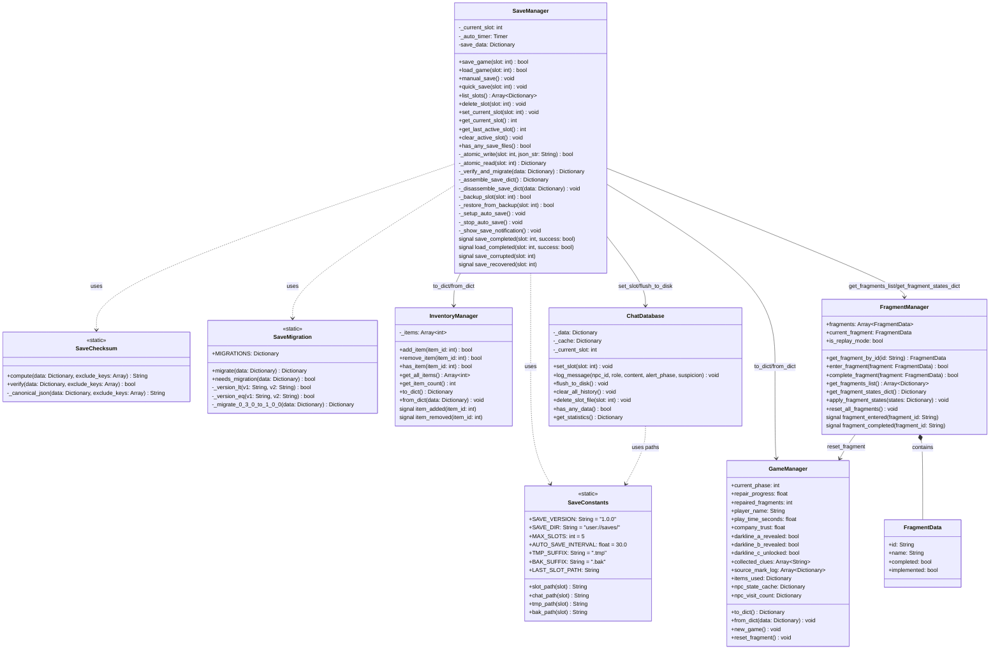
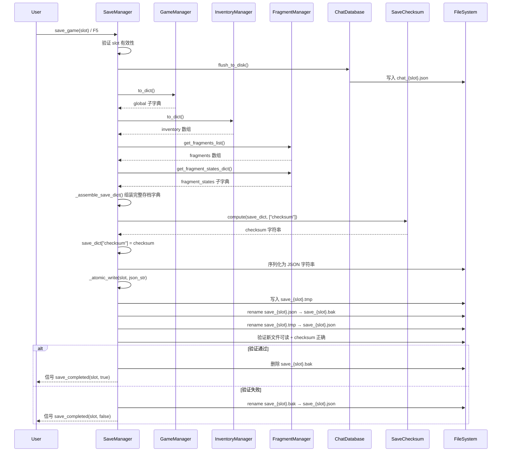
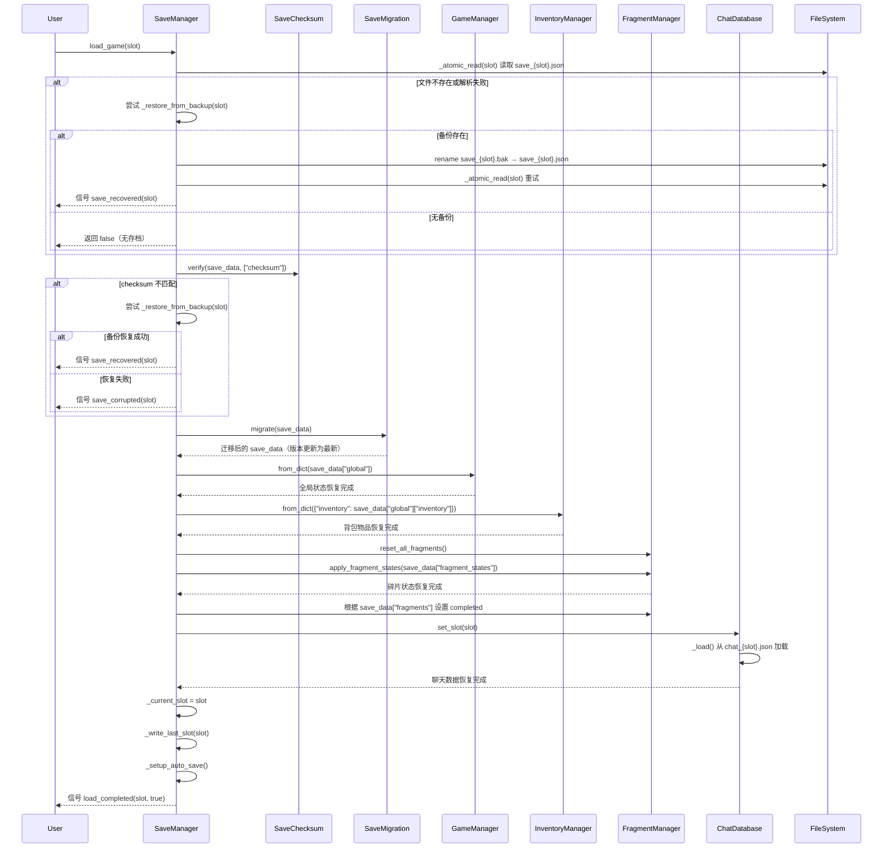
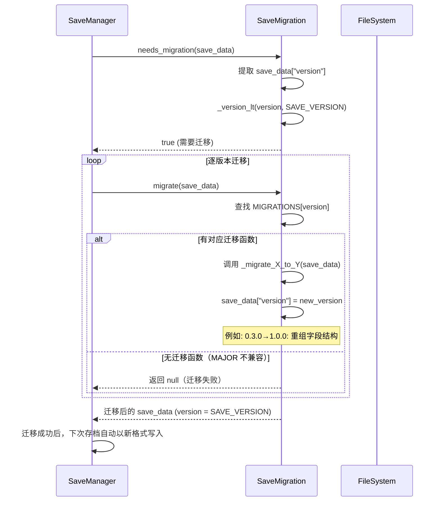
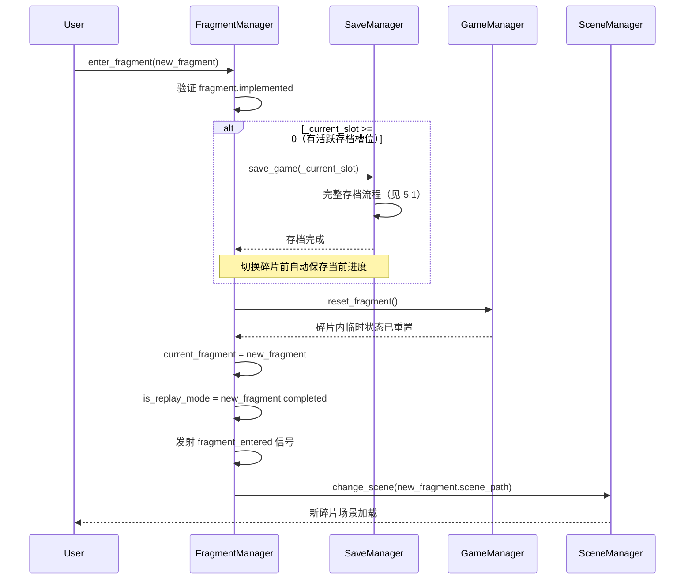
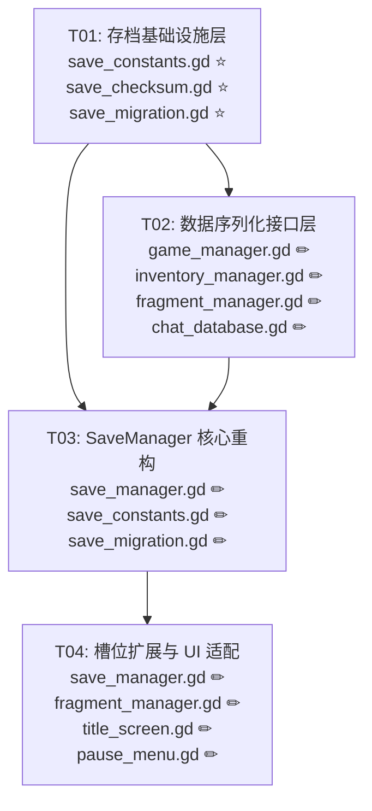

# 溯光计划 — 存档系统架构设计

> 版本：v1.0  
> 创建日期：2025-07-01  
> 关联 PRD：`design/save_system/save_system_prd.md`  
> 架构师：Bob (software-architect)

---

## Part A: 系统设计

### 1. 实现方案（Implementation Approach）

#### 1.1 核心问题分析

| # | 痛点 | 根因 | 解决方案 |
|---|------|------|---------|
| 1 | SaveManager 逐字段硬编码读写 GameManager 30+ 属性 | 紧耦合，无序列化抽象 | GameManager/InventoryManager/FragmentManager 各自提供 `to_dict()` / `from_dict()` |
| 2 | 存档写入无原子性保护 | 直接 `FileAccess.WRITE` 覆盖 | tmp → rename 两步原子写入策略 |
| 3 | 无版本号/迁移机制 | 硬编码 `"0.3.0"` 无迁移逻辑 | 语义化版本号 + Migration 注册表 + 加载时自动迁移 |
| 4 | 无完整性校验 | 无 checksum | SHA-256 校验和嵌入 JSON，加载时验证 |
| 5 | 背包物品未持久化 | InventoryManager._items 不在存档范围 | InventoryManager.to_dict() / from_dict() |
| 6 | 聊天数据双副本 | save_{slot}.json 内嵌 + chat_{slot}.json 独立 | 仅用 chat_{slot}.json，SaveManager 不再内嵌 |
| 7 | 碎片专属状态散落顶层 | GameManager 承载 #0762 专属字段 | `fragment_states.<fragment_id>.*` 嵌套结构 |
| 8 | 仅 3 槽位，对 12 碎片叙事游戏不足 | MAX_SLOTS=3 | 扩展至 5 槽位 |

#### 1.2 整体架构策略

```
┌─────────────────────────────────────────────────┐
│                  SaveManager                      │
│  ┌─────────┐ ┌──────────┐ ┌──────────────────┐  │
│  │ Atomic  │ │ Checksum │ │  Migration        │  │
│  │ Write   │ │ Verifier │ │  Engine           │  │
│  └─────────┘ └──────────┘ └──────────────────┘  │
│         │            │              │             │
│    save_game()   load_game()   _migrate_if_needed│
└────────┬──────────────┬──────────────┬───────────┘
         │              │              │
    ┌────▼────┐   ┌─────▼─────┐  ┌────▼──────────┐
    │ Game    │   │ Inventory │  │ Fragment       │
    │ Manager │   │ Manager   │  │ Manager        │
    │to_dict()│   │to_dict()  │  │fragment_states │
    │from_dict│   │from_dict()│  │to/from_dict()  │
    └─────────┘   └───────────┘  └────────────────┘
         │              │              │
         └──────────────┼──────────────┘
                        │
              ┌─────────▼──────────┐
              │  存档 JSON 结构     │
              │  version + checksum│
              │  global / fragments│
              │  fragment_states   │
              └────────────────────┘
```

**数据流**：
- **存档**：SaveManager.save_game() → 调用各 Manager.to_dict() → 组装 JSON → 计算 checksum → 原子写入 → 维护 .bak
- **读档**：SaveManager.load_game() → 原子读取 → 验证 checksum → 版本迁移（如需要）→ 调用各 Manager.from_dict() → ChatDatabase.set_slot()

### 2. 框架选型（Framework Selection）

| 技术 | 用途 | 说明 |
|------|------|------|
| Godot 4.x Autoload | 单例管理器 | SaveManager / GameManager / InventoryManager / FragmentManager / ChatDatabase 均为 Autoload，内存常驻 |
| `FileAccess` | 文件 I/O | Godot 内置，用于存档 JSON 读写 |
| `DirAccess` | 目录操作 | 创建/删除存档目录、rename（原子写入）、备份管理 |
| `JSON` | 序列化/反序列化 | Godot 内置 JSON 解析器 |
| `HashingContext` | SHA-256 校验和 | Godot 内置哈希工具（`HashingContext.HASH_SHA256`） |
| `Time` | 时间戳 | Godot 内置，`get_unix_time_from_system()` / `get_datetime_string_from_system()` |
| `signal` | 事件通信 | Godot 内置信号机制，用于存档完成通知 |
| GDScript Dictionary/Array | 数据容器 | 原生类型，无外部依赖 |

> **无外部依赖**：所有功能基于 Godot 4.x 内置 API 实现，无需第三方库。

### 3. 文件列表（File List）

| # | 文件路径 | 操作 | 职责 |
|---|---------|------|------|
| 1 | `scripts/globals/save_constants.gd` | ⭐ 新建 | 存档版本号、路径常量、槽位配置、存档 JSON Schema 定义 |
| 2 | `scripts/globals/save_checksum.gd` | ⭐ 新建 | SHA-256 校验和计算/验证工具（静态函数） |
| 3 | `scripts/globals/save_migration.gd` | ⭐ 新建 | 版本迁移框架：注册表 + 逐版本迁移 + 版本比较 |
| 4 | `scripts/globals/save_manager.gd` | ✏ 修改 | **核心重构**：原子写入、校验和、迁移调用、备份恢复、使用序列化 API、槽位扩展至 5 |
| 5 | `scripts/globals/game_manager.gd` | ✏ 修改 | 新增 `to_dict()` / `from_dict()`；移除碎片专属字段到 fragment_states |
| 6 | `scripts/systems/inventory_manager.gd` | ✏ 修改 | 新增 `to_dict()` / `from_dict()` |
| 7 | `scripts/globals/fragment_manager.gd` | ✏ 修改 | 新增 `get_fragment_states_dict()` / `apply_fragment_states()` / `get_fragments_list()`；`enter_fragment()` 内自动存档；`is_replay_mode` 标记 |
| 8 | `scripts/globals/chat_database.gd` | ✏ 修改 | 移除 save_{slot}.json 内嵌双副本逻辑（保留 chat_{slot}.json 独立存储不变）；清理不再需要的 `get_raw_data()` / `restore_from()` |
| 9 | `scripts/ui/title_screen.gd` | ✏ 修改 | 槽位 UI 适配 5 槽位 |
| 10 | `scripts/ui/pause_menu.gd` | ✏ 修改 | 暂停菜单存档/读档 UI 适配新槽位 |

### 4. 数据结构与接口设计（Class Diagram）

> 以下 Mermaid 类图展示核心类/单例的关系、新增方法签名及关键属性。



### 5. 程序调用流程（Sequence Diagrams）

#### 5.1 存档流程（save_game）



#### 5.2 读档流程（load_game）



#### 5.3 版本迁移流程



#### 5.4 碎片切换自动存档流程



### 6. Anything UNCLEAR

| # | 疑问点 | 当前假设 |
|---|--------|---------|
| 1 | `HashingContext` 在 Godot 4.x 中的具体 API（`HashingContext.start()` / `update()` / `finish()` 返回值）需要实测确认 | 按 Godot 4.x 文档标准 API 设计，实现时验证 |
| 2 | `DirAccess.rename_absolute()` 在 Windows 上的原子性保证程度 | Godot 内部调用 OS rename，Posix 保证原子性，Windows NTFS 也基本保证；设计仍有 .bak 兜底 |
| 3 | 现有存档 `0.3.0` 格式中的字段映射到 `1.0.0` 结构，部分字段可能已在碎片场景中动态修改 | 迁移时以 JSON 中实际存储值为准，缺失字段填充默认值 |
| 4 | `title_screen.gd` 的具体 UI 结构（当前槽位卡片实现方式）未深入分析 | 仅扩展槽位数量，保持现有 UI 结构不变；详细 UI 调整由工程师按实际情况处理 |
| 5 | P1-04 "重玩模式标记" 的具体行为（重玩时是否阻止某些操作，如再次增加修复进度） | 标记存在但不在此阶段实现复杂的重玩逻辑，仅确保标记正确持久化和恢复 |

---

## Part B: 任务分解（Task Decomposition）

### 6. 依赖包列表（Required Packages）

```
无外部依赖。
所有功能基于 Godot 4.x 内置 API 实现：
- FileAccess（文件读写）
- DirAccess（目录操作、rename）
- JSON（序列化/反序列化）
- HashingContext（SHA-256 校验和）
- Time（时间戳）
```

### 7. 任务列表（Task List）

> ⚠️ 硬性约束：不超过 5 个任务，每个任务至少 3 个文件，按依赖关系排列。

---

#### T01：存档基础设施层（新建工具模块）

| 字段 | 内容 |
|------|------|
| **Task ID** | T01 |
| **Task Name** | 存档基础设施层：常量定义 + 校验和 + 迁移框架 |
| **Source Files** | `scripts/globals/save_constants.gd` ⭐新建<br>`scripts/globals/save_checksum.gd` ⭐新建<br>`scripts/globals/save_migration.gd` ⭐新建 |
| **Dependencies** | 无 |
| **Priority** | P0 |
| **对应需求** | P0-03（版本号）、P0-04（校验和）、P1-05（槽位常量） |

**详细说明**：

1. **`save_constants.gd`** — 存档系统常量与路径工具
   - `SAVE_VERSION = "1.0.0"` — 当前存档格式版本
   - `MAX_SLOTS = 5` — 槽位总数（从 3 扩展）
   - 路径常量：`SAVE_DIR`、`LAST_SLOT_PATH`、`TMP_SUFFIX`、`BAK_SUFFIX`
   - 静态方法：`slot_path(slot)`、`chat_path(slot)`、`tmp_path(slot)`、`bak_path(slot)`

2. **`save_checksum.gd`** — SHA-256 校验和工具（纯静态）
   - `compute(data: Dictionary, exclude_keys: Array[String]) -> String`：计算 JSON 字典的 SHA-256 校验和（排除 `checksum` 自身），返回 hex 字符串
   - `verify(data: Dictionary, exclude_keys: Array[String]) -> bool`：验证校验和，返回 true/false
   - `_canonical_json(data, exclude_keys)`：生成规范化 JSON 字符串用于哈希（使用 `JSON.stringify` 保证一致性）

3. **`save_migration.gd`** — 版本迁移框架（纯静态）
   - `MIGRATIONS: Dictionary` — 版本 → 迁移函数映射表
   - `migrate(data: Dictionary) -> Dictionary`：检测版本并按序执行迁移链，返回迁移后的数据
   - `needs_migration(data: Dictionary) -> bool`：判断是否需要迁移
   - `_version_lt(v1, v2) -> bool`：语义化版本比较
   - `_migrate_0_3_0_to_1_0_0(data) -> Dictionary`：首个迁移函数——将旧扁平结构重组为 `global`/`fragments`/`fragment_states` 三层结构

---

#### T02：数据序列化接口层（Manager 改造）

| 字段 | 内容 |
|------|------|
| **Task ID** | T02 |
| **Task Name** | 数据序列化接口层：GameManager + InventoryManager + FragmentManager + ChatDatabase 接口改造 |
| **Source Files** | `scripts/globals/game_manager.gd` ✏修改<br>`scripts/systems/inventory_manager.gd` ✏修改<br>`scripts/globals/fragment_manager.gd` ✏修改<br>`scripts/globals/chat_database.gd` ✏修改 |
| **Dependencies** | T01 |
| **Priority** | P0 |
| **对应需求** | P0-01（背包持久化）、P0-05（GameManager 解耦）、P1-01（聊天单源）、P1-03（碎片状态命名空间） |

**详细说明**：

1. **`game_manager.gd`** — 新增序列化接口 + 移除碎片专属字段
   - 新增 `to_dict() -> Dictionary`：将全局状态序列化为 `global` 子字典（包含 `inventory` 字段，由 SaveManager 从 InventoryManager 获取后填入）
   - 新增 `from_dict(data: Dictionary) -> void`：从字典恢复所有全局状态，缺失字段使用默认值
   - **移除碎片专属属性**：`awakened_colors`、`melody_triggered`、`source_mark_revealed`、`fragment_completed`、`white_ready`、`gray_cloth_uncovered`、`oldpainter_trust` 从 GameManager 顶层移除
   - 这些属性的访问改为通过 `FragmentManager.current_fragment_state` 或 `fragment_states` 字典
   - ⚠️ 同步修改所有引用上述属性的现有代码（如 `fragment_0762.gd`、`fragment_0762_state.gd`）

2. **`inventory_manager.gd`** — 新增序列化接口
   - 新增 `to_dict() -> Dictionary`：返回 `{"inventory": _items.duplicate()}`
   - 新增 `from_dict(data: Dictionary) -> void`：`_items = data.get("inventory", []).duplicate()`

3. **`fragment_manager.gd`** — 新增碎片状态序列化 + 重玩标记
   - 新增 `get_fragments_list() -> Array[Dictionary]`：返回 `[{id, completed}, ...]`
   - 新增 `get_fragment_states_dict() -> Dictionary`：遍历所有有专属状态的碎片，收集其状态到 `fragment_states` 子字典
   - 新增 `apply_fragment_states(states: Dictionary) -> void`：将 `fragment_states` 字典应用到对应碎片的 State 对象
   - 新增 `is_replay_mode: bool` — 标记当前是否重玩已完成碎片
   - 修改 `enter_fragment()`：在 `GameManager.reset_fragment()` 之前调用 `SaveManager.save_game()`（若槽位有效）；设置 `is_replay_mode = fragment.completed`

4. **`chat_database.gd`** — 清理双副本遗留
   - 移除 `get_raw_data()` — 不再向 SaveManager 提供聊天数据快照
   - 移除 `restore_from()` — SaveManager 不再需要将聊天数据恢复到 ChatDatabase
   - `flush_to_disk()` 保留（供碎片切换前调用）
   - `set_slot()` 保留（读档后由 SaveManager 调用以加载对应槽位聊天文件）

---

#### T03：SaveManager 核心重构

| 字段 | 内容 |
|------|------|
| **Task ID** | T03 |
| **Task Name** | SaveManager 核心重构：原子写入 + 校验和 + 迁移集成 + 备份恢复 + 序列化 API 接入 |
| **Source Files** | `scripts/globals/save_manager.gd` ✏修改（重写核心逻辑）<br>`scripts/globals/save_constants.gd` ✏修改（如有调整）<br>`scripts/globals/save_migration.gd` ✏修改（接入实测） |
| **Dependencies** | T01、T02 |
| **Priority** | P0 |
| **对应需求** | P0-02（原子写入）、P0-03（迁移框架集成）、P0-04（校验和集成）、P1-02（备份恢复） |

**详细说明**：

**`save_manager.gd`** 核心重写——保持现有 API 签名不变，内部全部重写：

1. **`save_game(slot) -> bool`** 重写：
   - 调用 `ChatDatabase.flush_to_disk()`
   - 通过 `_assemble_save_dict()` 组装存档字典（使用 T02 新增的序列化 API）
   - 调用 `SaveChecksum.compute()` 计算校验和
   - 调用 `_atomic_write()` 执行原子写入
   - 发射 `save_completed` 信号

2. **`_assemble_save_dict() -> Dictionary`**（新方法）：
   ```gdscript
   {
     "version": SAVE_VERSION,
     "slot": slot,
     "timestamp": ...,
     "timestamp_readable": ...,
     "save_name": ...,
     "checksum": "",  # 稍后填充
     "global": GameManager.to_dict() + InventoryManager.to_dict(),
     "fragments": FragmentManager.get_fragments_list(),
     "fragment_states": FragmentManager.get_fragment_states_dict()
   }
   ```

3. **`_disassemble_save_dict(data) -> void`**（新方法）：
   - `GameManager.from_dict(data["global"])`
   - `InventoryManager.from_dict(data["global"])`（inventory 在 global 子字典中）
   - `FragmentManager.reset_all_fragments()` → `apply_fragment_states(data["fragment_states"])`

4. **`_atomic_write(slot, json_str) -> bool`**（新方法）：
   - 写入 `save_{slot}.tmp`
   - `DirAccess.rename_absolute()` 将原文件 → `.bak`
   - `DirAccess.rename_absolute()` 将 `.tmp` → `.json`
   - 验证新文件可解析且 checksum 正确
   - 验证通过 → 删除 `.bak`；失败 → 恢复 `.bak` → `.json`

5. **`load_game(slot) -> bool`** 重写：
   - `_atomic_read()` 读取文件
   - `SaveChecksum.verify()` 验证校验和
   - 损坏 → `_restore_from_backup()` 尝试恢复
   - `SaveMigration.migrate()` 版本迁移
   - `_disassemble_save_dict()` 恢复状态
   - `ChatDatabase.set_slot(slot)` 加载聊天数据
   - 发射 `load_completed` 信号

6. **`_restore_from_backup(slot) -> bool`**（新方法）：
   - 检查 `.bak` 文件存在 → 验证其 checksum → 重命名为 `.json`
   - 发射 `save_recovered` 信号

7. **`list_slots()`** 更新：适配新的 JSON 结构路径（`data["global"]["play_time_seconds"]` 等）

8. **`delete_slot()`** 更新：同时删除 `.bak` 和 `.tmp`

9. **新信号**：`save_completed(slot, success)`、`load_completed(slot, success)`、`save_corrupted(slot)`、`save_recovered(slot)`

---

#### T04：槽位扩展、碎片切换自动存档与 UI 适配

| 字段 | 内容 |
|------|------|
| **Task ID** | T04 |
| **Task Name** | 槽位扩展（3→5）+ 碎片切换自动存档 + 重玩标记集成 + UI 适配 |
| **Source Files** | `scripts/globals/save_manager.gd` ✏修改（槽位扩展最终配置 + 自动存档钩子）<br>`scripts/globals/fragment_manager.gd` ✏修改（enter_fragment 自动存档 + 重玩标记最终集成）<br>`scripts/ui/title_screen.gd` ✏修改（5 槽位 UI）<br>`scripts/ui/pause_menu.gd` ✏修改（存档/读档 UI） |
| **Dependencies** | T03 |
| **Priority** | P1 |
| **对应需求** | P1-04（重玩标记）、P1-05（5 槽位）、Q6（切换碎片前自动存档） |

**详细说明**：

1. **`save_manager.gd`** — 槽位扩展确认 + `save_game()` 公开调用支持
   - `MAX_SLOTS` 已在 T01 的 `save_constants.gd` 中设为 5，此处确保所有槽位循环逻辑正确（`list_slots()`、`delete_slot()`、`get_last_active_slot()` 等均基于 `MAX_SLOTS` 动态计算）

2. **`fragment_manager.gd`** — 碎片切换自动存档 + 重玩标记
   - `enter_fragment()` 中：调用 `SaveManager.get_current_slot()` 检查活跃槽位，若 ≥ 0 则先 `SaveManager.save_game()`
   - `is_replay_mode` 在 `enter_fragment()` 中设置为 `fragment.completed`（进入前判断，进入后 fragment 的 completed 可能被 reset_fragment 重置为 false——需要先保存旧值）
   - `reset_fragment()` 调用后 `is_replay_mode` 不应被重置

3. **`title_screen.gd`** — UI 适配 5 槽位
   - 修改槽位列表生成逻辑，支持 5 个槽位
   - 适配新的存档摘要数据结构（`save_data["global"]["play_time_seconds"]` 等路径变化）

4. **`pause_menu.gd`** — 暂停菜单适配
   - 存档/读档槽位选择适配 5 槽位
   - 如有手动存档按钮，确认其调用链正确

### 8. 共享知识（Shared Knowledge）

#### 8.1 命名规范

| 规范 | 示例 |
|------|------|
| 存档文件 | `save_{slot}.json`（如 `save_0.json`） |
| 临时文件 | `save_{slot}.tmp` |
| 备份文件 | `save_{slot}.bak` |
| 聊天文件 | `chat_{slot}.json`（保持不变） |
| 槽位记录 | `last_slot.json` |
| 版本号常量 | `SAVE_VERSION = "1.0.0"` |
| Godot 方法命名 | 遵循 GDScript snake_case 规范 |

#### 8.2 错误处理约定

```
所有文件操作 → 检查返回值，失败时打印 printerr() 并返回 false/空字典
校验和失败 → 发射 save_corrupted 信号，尝试从 .bak 恢复
备份恢复失败 → 发射 save_corrupted 信号，不阻塞流程
版本迁移失败（MAJOR 不兼容） → 提示用户，不加载
原子写入验证失败 → 自动回滚到 .bak
```

#### 8.3 信号约定

| 信号 | 发射者 | 参数 | 说明 |
|------|--------|------|------|
| `save_completed` | SaveManager | `slot: int, success: bool` | 存档操作完成（成功或失败） |
| `load_completed` | SaveManager | `slot: int, success: bool` | 读档操作完成 |
| `save_corrupted` | SaveManager | `slot: int` | 存档损坏且无法恢复 |
| `save_recovered` | SaveManager | `slot: int` | 从备份成功恢复 |
| `fragment_entered` | FragmentManager | `fragment_id: String` | 进入碎片（含自动存档后） |

#### 8.4 存档 JSON 最终结构约定

```json
{
  "version": "1.0.0",          // 语义化版本号，SaveConstants.SAVE_VERSION
  "slot": 0,                    // 槽位编号
  "timestamp": 1719820800,      // Unix 时间戳
  "timestamp_readable": "...",  // 可读时间
  "save_name": "溯光档案 01",   // 存档名称
  "checksum": "a1b2c3d4...",   // SHA-256（排除自身）前16字符
  "global": {                   // GameManager + InventoryManager 的全局状态
    "play_time_seconds": 3600.0,
    "repair_progress": 0.25,
    "current_phase": 1,
    "player_name": "溯光者-07",
    "company_trust": 0.85,
    "darkline_a_revealed": false,
    "darkline_b_revealed": false,
    "darkline_c_unlocked": false,
    "collected_clues": [],
    "source_mark_log": [],
    "items_used": {},
    "inventory": [],
    "npc_state_cache": {},
    "npc_visit_count": {}
  },
  "fragments": [                // 碎片完成状态列表
    {"id": "0001", "completed": false},
    {"id": "0762", "completed": true}
  ],
  "fragment_states": {          // 碎片专属状态（按 fragment_id 命名空间）
    "0762": {
      "awakened_colors": [true, false, false, false, false, false],
      "melody_triggered": false,
      "source_mark_revealed": true,
      "white_ready": false,
      "gray_cloth_uncovered": true,
      "oldpainter_trust": 25.0,
      "fragment_completed": true
    }
  }
}
```

#### 8.5 跨文件修改注意事项

- 当 `fragment_0762.gd` / `fragment_0762_state.gd` 中引用了 `GameManager.awakened_colors` 等碎片专属属性时，需改为通过 FragmentManager 或 `fragment_states` 字典访问
- `npc_controller.gd` 中如有引用 GameManager 碎片专属属性，同样需要调整
- 所有 `_on_*` 信号回调中如涉及迁移的字段，需要同步更新

### 9. 任务依赖图（Task Dependency Graph）



---

> **设计完成**。下一步：由 Engineer 按 T01 → T02 → T03 → T04 顺序实现。T04 与 T03 有一定独立性（UI 适配可并行），但 T04 依赖 T03 完成后的最终 SaveManager API。

---

## 附录：架构评审笔记

### A. 关键设计权衡

| 权衡点 | 选择 | 理由 |
|--------|------|------|
| `fragment_states` 管理器 | 由 FragmentManager 统一管理 | 避免在 SaveManager 中引入碎片状态结构的知识 |
| 校验和算法 | SHA-256（取前 16 字符） | 防碰撞需求不高（非安全场景），前 16 字符足够区分 |
| 临时文件策略 | `.tmp` → `.bak` → 验证 → 清理 | 两层保护：验证失败的极端情况下 `.bak` 仍在 |
| Inventory 在 global 中 | `global.inventory` | 虽属于 InventoryManager，但从存档结构角度应放在全局状态中，InventoryManager.to_dict() 返回的字典合并入 global |

### B. 风险登记

| 风险 | 影响 | 缓解 |
|------|------|------|
| `fragment_0762.gd` 等碎片代码大量引用 `GameManager.awakened_colors` 等 | T02 修改范围可能扩大 | T02 中需完整 grep 所有引用点并统一修改 |
| Godot 的 `DirAccess.rename_absolute()` 在不同平台行为差异 | 原子性可能不保证 | .bak 兜底策略覆盖所有情况 |
| 现有 0.3.0 格式存档的字段可能有未知变种 | 迁移可能不完整 | 迁移函数使用 `.get()` 并记录 warning |
